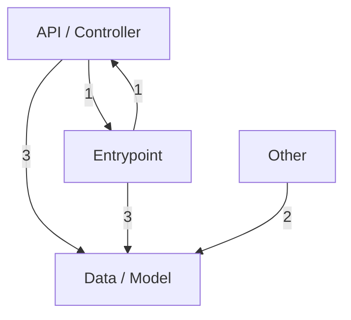
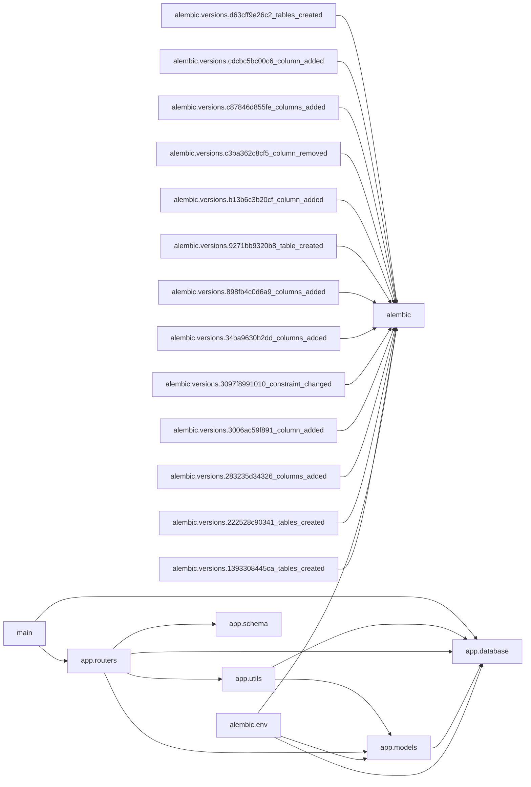

# Architecture

_Project: e-commerce_

This document is generated from the Repository Knowledge Graph
(`repository_knowledge.json`) built by deterministic source analysis.

## Overview

- Primary language: Python
- Detected frameworks: FastAPI, SQLAlchemy, Starlette
- Architecture pattern (heuristic): Layered Architecture

## Code Structure

- Modules parsed: 20
- Functions: 51 (15 async)
- Classes: 12 (methods: 0)
- Import statements: 87
- External packages: 13

## Layers

Modules are grouped into architectural layers inferred from naming conventions.

| Layer | Modules |
|---|---|
| API / Controller | 1 |
| Data / Model | 3 |
| Entrypoint | 2 |
| Other | 14 |

### Layer interaction

## Module Dependencies

## Circular Dependencies

None detected. Module dependencies form an acyclic graph.

## APIs

Detected web frameworks: FastAPI.
See `API_REFERENCE.md` for the full endpoint list.

---
_Generated by Repository Intelligence (Phase 2) from `repository_knowledge.json`._
