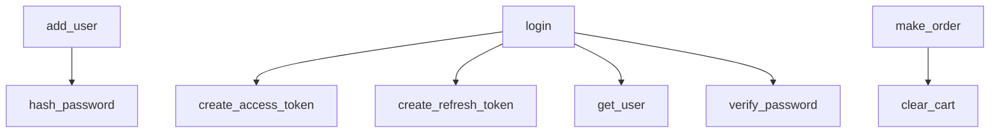

# Call Graph

_Project: e-commerce_

Caller/callee relationships resolved deterministically by name from the parsed
source models.

## Summary

- Functions/methods: 51
- Call relationships: 6
- Entry points (uncalled): 3

## Diagram

## Relationships

- `app.routers.add_user` -> `app.utils.hash_password`
- `app.routers.login` -> `app.utils.create_access_token`
- `app.routers.login` -> `app.utils.create_refresh_token`
- `app.routers.login` -> `app.utils.get_user`
- `app.routers.login` -> `app.utils.verify_password`
- `app.routers.make_order` -> `app.utils.clear_cart`

---
_Generated by Repository Intelligence (Phase 2) from `repository_knowledge.json`._
