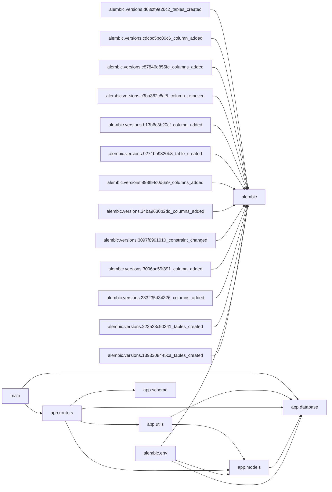

# Module Dependency Graph

_Project: e-commerce_

Internal modules: 20. Dependencies: 25.

## Diagram

## Modules

| Module | Layer | Depends on |
|---|---|---|
| `alembic.env` | Other | 3 |
| `alembic.versions.1393308445ca_tables_created` | Other | 1 |
| `alembic.versions.222528c90341_tables_created` | Other | 1 |
| `alembic.versions.283235d34326_columns_added` | Other | 1 |
| `alembic.versions.3006ac59f891_column_added` | Other | 1 |
| `alembic.versions.3097f8991010_constraint_changed` | Other | 1 |
| `alembic.versions.34ba9630b2dd_columns_added` | Other | 1 |
| `alembic.versions.898fb4c0d6a9_columns_added` | Other | 1 |
| `alembic.versions.9271bb9320b8_table_created` | Other | 1 |
| `alembic.versions.b13b6c3b20cf_column_added` | Other | 1 |
| `alembic.versions.c3ba362c8cf5_column_removed` | Other | 1 |
| `alembic.versions.c87846d855fe_columns_added` | Other | 1 |
| `alembic.versions.cdcbc5bc00c6_column_added` | Other | 1 |
| `alembic.versions.d63cff9e26c2_tables_created` | Other | 1 |
| `app.database` | Data / Model | 0 |
| `app.models` | Data / Model | 1 |
| `app.routers` | API / Controller | 4 |
| `app.schema` | Data / Model | 0 |
| `app.utils` | Entrypoint | 2 |
| `main` | Entrypoint | 2 |

## External Packages

`datetime`, `fastapi`, `jose`, `logging`, `os`, `passlib`, `pydantic`, `shutil`, `sqlalchemy`, `starlette`, `typing`, `uuid`, `uvicorn`

## Circular Dependencies

None detected. Module dependencies form an acyclic graph.

---
_Generated by Repository Intelligence (Phase 2) from `repository_knowledge.json`._
